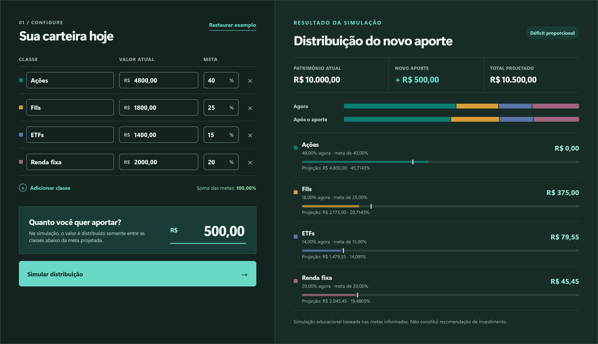

# Planejador de Carteira

[](https://github.com/thiagojosetj/pagina-investimentos/actions/workflows/ci.yml)
[](LICENSE)

Plataforma full stack educacional para planejar a alocação de uma carteira de investimentos. O módulo disponível hoje compara a alocação informada com metas definidas pelo próprio usuário e simula novos aportes de forma determinística.

> **Aviso:** este projeto é uma ferramenta de estudo e planejamento. Não seleciona ativos, não analisa perfil de investidor e não constitui recomendação de compra ou venda.



Simulador de aportes com o exemplo sintético da própria interface. O aporte de R$ 500,00 é insuficiente para zerar os déficits, então é dividido proporcionalmente entre eles: R$ 375,00 + R$ 79,55 + R$ 45,45 fecham exatamente os R$ 500,00, sem sobra nem centavo criado. Ações já está acima da meta e recebe R$ 0,00. O cálculo é feito no backend em centavos inteiros; a interface apenas formata o resultado.

## O que funciona hoje

- **Simulador de aportes de ponta a ponta:** interface React com classes, valores atuais, metas e aporte editáveis, conectada a uma API Spring Boot.
- **Distribuição proporcional aos déficits** sobre o patrimônio projetado, sem sugerir vendas.
- **Visão geral demonstrativa** com dados sintéticos, filtro por categoria e modos claro e escuro.
- **Transferência demonstrativa para o simulador:** o botão “Simular esta demonstração” preenche as cinco classes sintéticas, inclusive a hipótese de caixa, sem enviar a requisição até a pessoa confirmar a simulação. Não carrega uma carteira salva.
- **API documentada** com OpenAPI e Swagger UI, com erros no formato `application/problem+json`.
- **Persistência de carteiras e metas** com PostgreSQL e Flyway, coberta por testes de integração, ainda sem endpoint público.

## Destaques técnicos

- **Dinheiro em centavos inteiros.** Os valores trafegam como strings decimais e são calculados em `BigInteger`. Os centavos que sobram são distribuídos pelo método dos maiores restos, com desempate determinístico, então a soma sempre fecha exatamente com o aporte.
- **Regras no backend.** O frontend coleta entradas e formata resultados; nenhum cálculo financeiro crítico é feito no navegador.
- **Organização por funcionalidade**, com camadas `api`, `application`, `domain` e `persistence`, DTOs e mappers explícitos.
- **Schema versionado.** O Flyway é o dono do schema e o Hibernate apenas valida os mapeamentos (`ddl-auto=validate`).
- **Atualização de metas protegida contra concorrência** pela versão da carteira (compare-and-set).
- **Testes em várias camadas:** domínio, API, integração com PostgreSQL real via Testcontainers e fluxo da interface com Vitest e Testing Library.
- **Configuração defensiva:** API ligada a `127.0.0.1` por padrão, limite de tamanho do corpo das requisições (HTTP 413) e respostas de erro sem stack trace.
- **CI no GitHub Actions** com jobs separados para backend e frontend, actions fixadas por SHA e permissões mínimas, além de Dependabot para Maven, npm e Actions.

## Ainda não implementado

- Contas, autenticação (planejada com login Google) e endpoints para salvar ou consultar carteiras.
- Ativos, movimentações, cotações, rentabilidade e proventos.
- Dashboard conectado: a visão geral atual usa uma fixture sintética.
- Preenchimento do simulador a partir de posições reais persistidas; a transferência demonstrativa usa exclusivamente valores fixos e fictícios.

Qualquer cotação externa dependerá de pesquisa e aprovação do provedor, licença, limites e defasagem.

## Stack

- **Backend:** Java 21, Spring Boot 4.1, Spring Data JPA, Flyway, Maven Wrapper e JUnit 6.
- **Frontend:** React 19, Vite 8, TypeScript 7, Vitest 5 e Testing Library.
- **Banco:** PostgreSQL 18 em Docker Compose e Testcontainers nos testes de integração.
- **Qualidade:** Spotless, Oxlint, Prettier, typecheck e GitHub Actions.

O sistema começa como um monólito modular com frontend separado. O backend é o único proprietário das regras financeiras.

## Executar localmente

Pré-requisitos: JDK 21, Node.js 24 LTS com npm e Docker (Docker Desktop no Windows e no macOS). Abra três terminais na raiz do projeto.

PowerShell:

```powershell
# Terminal 1 — PostgreSQL
if (-not (Test-Path .env)) { Copy-Item .env.example .env }
docker compose up -d --wait postgres

# Terminal 2 — API
Set-Location .\backend
.\mvnw.cmd spring-boot:run

# Terminal 3 — interface
Set-Location .\frontend
npm ci
npm run dev
```

Bash (Linux, macOS ou Git Bash):

```bash
# Terminal 1 — PostgreSQL
cp -n .env.example .env
docker compose up -d --wait postgres

# Terminal 2 — API
cd backend && ./mvnw spring-boot:run

# Terminal 3 — interface
cd frontend && npm ci && npm run dev
```

Acesse:

- Interface: <http://localhost:5173>
- Status da API: <http://localhost:8080/api/v1/system/status>
- Swagger UI: <http://localhost:8080/swagger-ui/index.html>
- OpenAPI JSON: <http://localhost:8080/v3/api-docs>

O servidor Vite encaminha as requisições iniciadas por `/api` para a API na porta `8080`. Para parar o banco sem perder dados, use `docker compose stop postgres`; `docker compose down -v` apaga o volume local.

Para experimentar a transferência demonstrativa, abra **Visão geral** e clique em **Simular esta demonstração**. Confira as cinco classes, incluindo Caixa (hipótese visual), e o aporte inicial editável de R$ 2.000,00; ajuste os campos se quiser e só então envie pelo botão de simulação. Trocar normalmente entre as abas preserva o rascunho manual; clicar novamente na ação demonstrativa substitui esse rascunho e limpa o resultado anterior. Nenhum dado dessa visão é uma carteira pessoal salva ou uma cotação atual.

Configurações de execução para o IntelliJ IDEA ficam em `.run/`. Detalhes do ambiente e solução de problemas estão em [`docs/local-development.md`](docs/local-development.md).

## Testes e verificações

Validação completa no Windows, a partir da raiz:

```powershell
.\scripts\check.ps1
```

Por módulo, em qualquer sistema:

```bash
cd backend && ./mvnw --no-transfer-progress verify
cd frontend && npm run check
```

O `verify` do Maven compila, executa os testes (inclusive os de integração com PostgreSQL via Testcontainers, que exigem o Docker ativo) e confere a formatação Java com Spotless; `./mvnw spotless:apply` corrige a formatação. `npm run check` executa format-check, lint, typecheck, testes e build.

## Contrato do simulador

Exemplo resumido:

```http
POST /api/v1/allocation-simulations/contributions
Content-Type: application/json
```

```json
{
  "currency": "BRL",
  "contribution": "2000.00",
  "allocations": [
    {
      "classId": "stocks",
      "name": "Ações",
      "currentAmount": "4800.00",
      "targetPercentage": "40.0000"
    },
    {
      "classId": "real-estate-funds",
      "name": "FIIs",
      "currentAmount": "1800.00",
      "targetPercentage": "25.0000"
    },
    {
      "classId": "etfs",
      "name": "ETFs",
      "currentAmount": "1400.00",
      "targetPercentage": "15.0000"
    },
    {
      "classId": "fixed-income",
      "name": "Renda fixa",
      "currentAmount": "2000.00",
      "targetPercentage": "20.0000"
    }
  ]
}
```

Decimais no JSON usam ponto e são enviados como strings. A interface aceita ponto ou vírgula e normaliza apenas o formato; nenhum cálculo financeiro crítico é feito no navegador.

## Documentação do projeto

- [`docs/PROJECT_SPEC.md`](docs/PROJECT_SPEC.md) — escopo e modelo proposto.
- [`docs/ROADMAP.md`](docs/ROADMAP.md) — incrementos pequenos e critérios de aceite.
- [`docs/DECISIONS.md`](docs/DECISIONS.md) — decisões e alternativas avaliadas.
- [`docs/PROJECT_STATUS.md`](docs/PROJECT_STATUS.md) — estado detalhado e próximo passo.
- [`docs/local-development.md`](docs/local-development.md) — ambiente local detalhado.

## Dados e licença

O exemplo, os testes e a interface usam somente valores sintéticos. Nenhum dado de mercado ou provedor externo é consumido nesta versão.

Código distribuído sob a [licença MIT](LICENSE).

## English summary

Educational full-stack portfolio planning app built with Java 21, Spring Boot, PostgreSQL, React and TypeScript. The current release provides a deterministic contribution simulator: amounts are handled as integer cents and leftover cents are assigned with the largest remainder method, so the split always adds up to the contribution. It is not financial advice and uses synthetic examples only.
